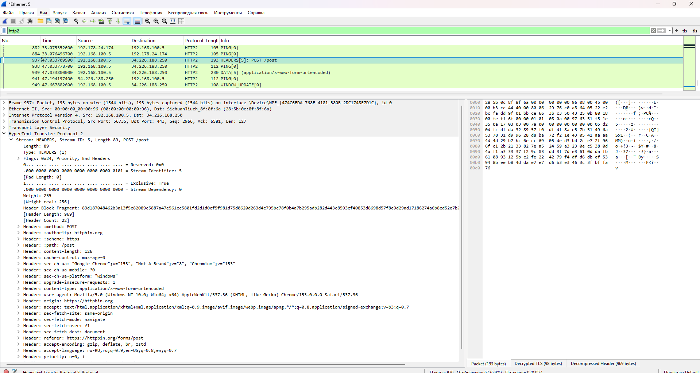
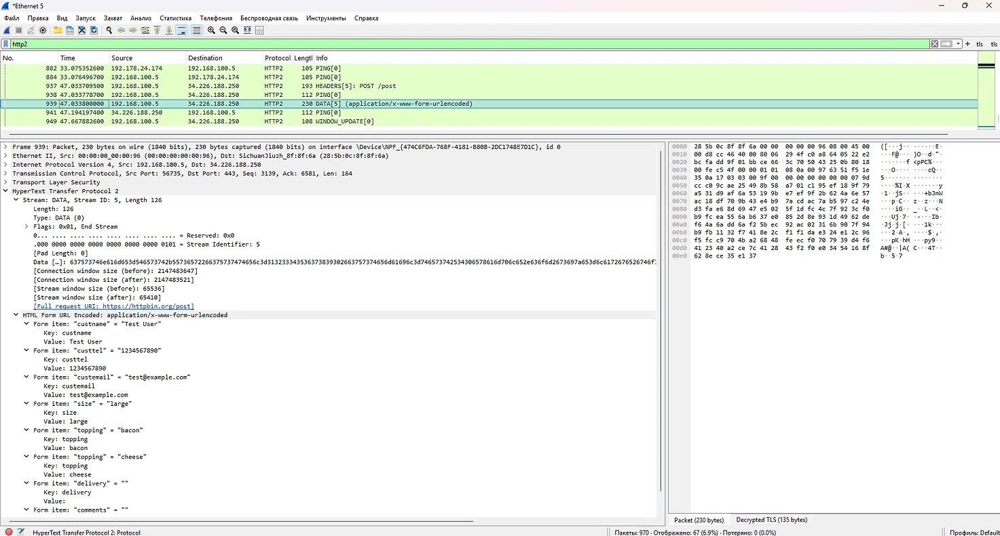

# Расшифровка HTTPS POST-запроса (httpbin.org)

## 🎯 Цель
Показать, что при наличии SSLKEYLOGFILE можно расшифровать HTTPS POST-запрос 
и увидеть передаваемые данные.

## 🛠️ Инструменты
- Wireshark 4.6.8
- Google Chrome
- SSLKEYLOGFILE
- Тестовый сервис: https://httpbin.org/forms/post

## 📋 Ход работы
1. Запустила захват трафика в Wireshark.
2. Открыла Chrome в режиме инкогнито, перешла на https://httpbin.org/forms/post.
3. Заполнила форму:
   - Customer name: Test User
   - Telephone: 1234567890
   - E-mail: test@example.com
   - Pizza Size: Large
   - Toppings: Bacon, Cheese
4. Отправила форму.
5. Остановила захват.
6. Применила фильтр `http2`.
7. Нашла POST-запрос: пакет №937 `HEADERS[5]: POST /post`.
8. В пакете №939 `DATA[5]` увидела данные формы.

## 🔍 Результат
Wireshark расшифровал HTTPS-трафик и показал:
- Метод: POST
- Путь: /post
- Хост: httpbin.org
- Content-Type: application/x-www-form-urlencoded
- Данные формы:
  - custname = Test User
  - custtel = 1234567890
  - custemail = test@example.com
  - size = large
  - topping = bacon
  - topping = cheese

Ответ сервера (JSON) подтвердил, что данные получены корректно.

## ✅ Выводы
1. HTTPS защищает данные только при отсутствии ключей шифрования.
2. С SSLKEYLOGFILE можно увидеть содержимое POST-запросов.
3. httpbin.org — удобный сервис для тестирования HTTP-запросов.

## 📸 Скриншоты
- 
- 
