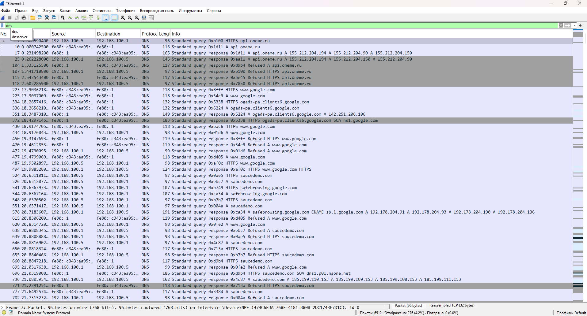

# Анализ DNS-запросов

## 🎯 Цель задания
Показать, какие домены запрашивает браузер при открытии сайтов.

## 🛠️ Инструменты
- Wireshark 4.6.8
- Google Chrome v120
- Windows 11

## 📋 Ход работы
1. Запустила захват трафика.
2. Открыла сайты: google.com, saucedemo.com, api.oneme.ru.
3. Остановила захват.
4. Применила фильтр: `dns`

## 🔍 Результат
В захвате видны DNS-запросы к доменам:
- api.oneme.ru
- www.google.com
- saucedemo.com
- safebrowsing.google.com

## ✅ Выводы
1. DNS-запросы передаются в открытом виде — видно, какие сайты посещает пользователь.
2. Это может быть использовано для анализа трафика.
3. Wireshark позволяет отслеживать DNS-запросы и определять IP-адреса сайтов.

## 📸 Скриншоты
- 
