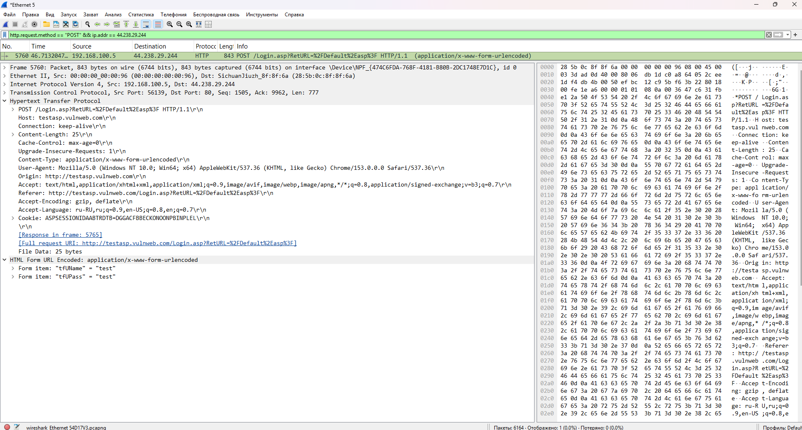

# Анализ HTTP-трафика: поиск открытых данных

## 🎯 Цель задания
Показать, что при использовании HTTP (без шифрования) логин и пароль
передаются в открытом виде и могут быть перехвачены.

## 🛠️ Инструменты
- Wireshark 4.6.8
- Google Chrome v120
- Windows 11
- Тестовый сайт: http://testasp.vulnweb.com/

## 📋 Ход работы
1. Запустила захват трафика в Wireshark.
2. Зашла на http://testasp.vulnweb.com/
3. Ввела логин `test` и пароль `test`, нажала Login.
4. Остановила захват.
5. Применила фильтр: `http.request.method == "POST" && ip.addr == 44.238.29.244`
6. Нашла POST-запрос, в теле которого видны логин и пароль.

## 🔍 Результат
В теле POST-запроса обнаружены:
- `tfUName = test`
- `tfUPass = test`

Логин и пароль передаются в открытом виде, так как сайт работает по HTTP.

## ✅ Выводы
1. HTTP не шифрует данные — логины и пароли можно перехватить.
2. HTTPS (TLS) защищает данные от перехвата.
3. Wireshark — инструмент для проверки безопасности передаваемых данных.

## 📸 Скриншоты
- 
