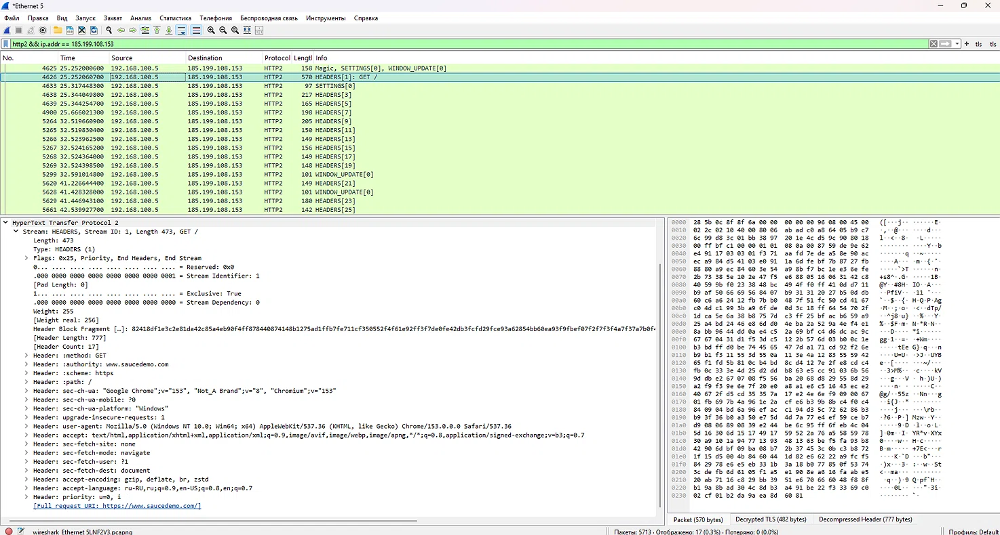

# Расшифровка HTTPS-трафика SauceDemo

## 🎯 Цель
Показать, что при наличии ключей шифрования (SSLKEYLOGFILE) можно 
расшифровать HTTPS-трафик и увидеть его содержимое.

## 🛠️ Инструменты
- Wireshark 4.6.8
- Google Chrome
- SSLKEYLOGFILE

## 📋 Ход работы
1. Создала файл `C:\sslkeys\sslkeylogfile.txt` и настроила переменную окружения.
2. В Wireshark указала путь к файлу ключей.
3. Захватила трафик SauceDemo.
4. Применила фильтр `http2 && ip.addr == 185.199.108.153`.

## 🔍 Результат
Wireshark расшифровал HTTPS-трафик и показал HTTP/2-запрос:
- GET / (запрос главной страницы)

В детализации пакета видны заголовки:
- `:method: GET`
- `:authority: www.saucedemo.com`
- `:path: /`
- `user-agent: Mozilla/5.0 ... Chrome/153.0.0.0`
- и другие.

**POST-запрос отсутствует**, потому что SauceDemo — статический сайт 
(хостится на GitHub Pages), и авторизация выполняется на стороне клиента.

## ✅ Выводы
1. SSLKEYLOGFILE + Wireshark = полная расшифровка HTTPS.
2. Расшифровка работает только при наличии ключей.
3. Статические сайты не отправляют данные на сервер.

## 📸 Скриншоты
- 
