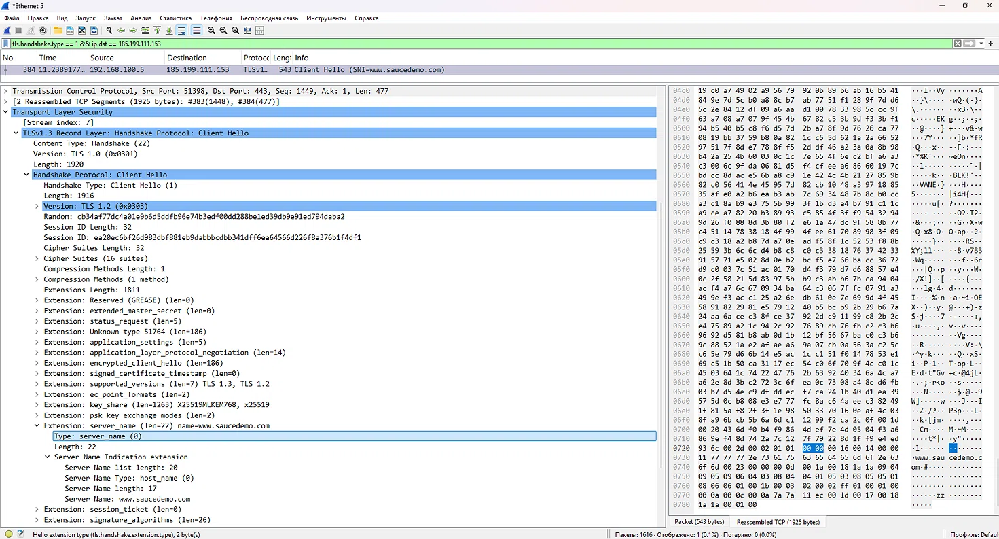
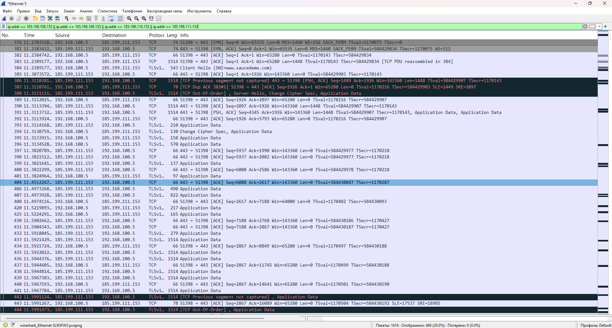
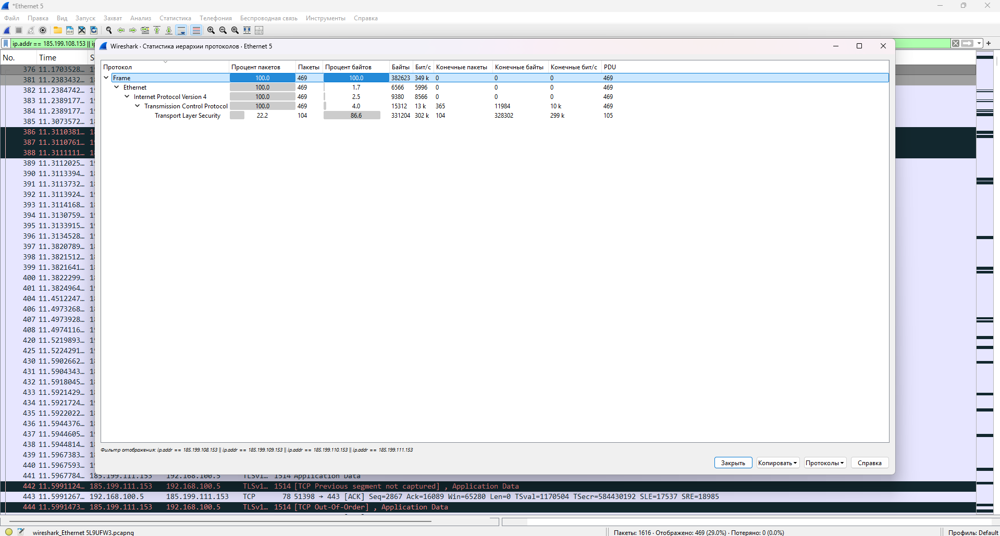
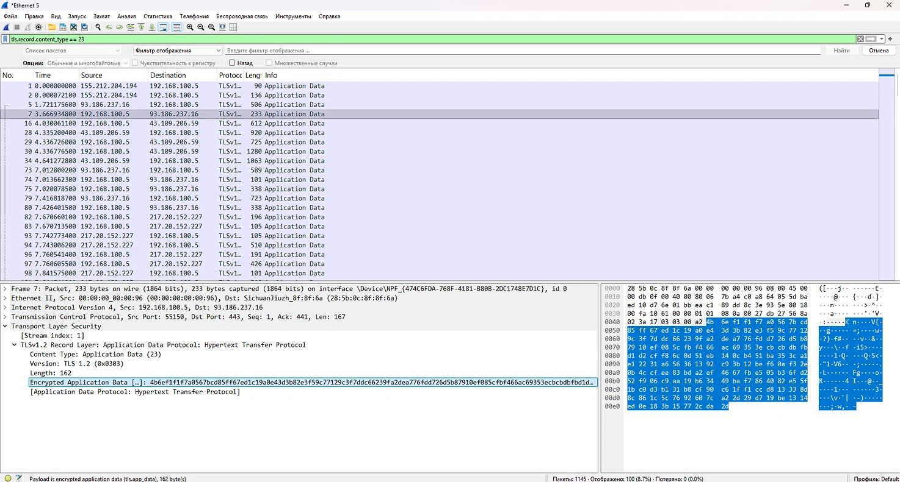
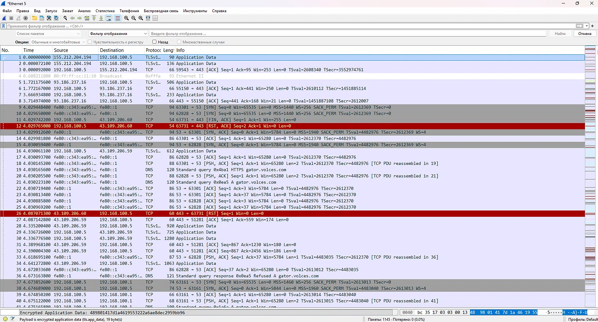

# Анализ сетевого трафика SauceDemo с помощью Wireshark

## 🎯 Цель задания

Перехватить и проанализировать сетевой трафик сайта [SauceDemo](https://www.saucedemo.com/) 
с помощью снифера Wireshark. Проверить, как браузер устанавливает защищённое 
соединение с сайтом и какие данные передаются по сети.

## 🛠️ Инструменты

- **Wireshark 4.6.8**
- **Google Chrome v120**
- **Windows 11**
- **Интерфейс:** Ethernet 5

## 📋 Ход работы

### 1. Определение IP-адреса SauceDemo

С помощью команды `nslookup saucedemo.com` определила IP-адреса сайта:

```
185.199.108.153
185.199.109.153
185.199.110.153
185.199.111.153
```

Это адреса **GitHub Pages**, на котором хостится SauceDemo.

### 2. Захват трафика

1. Запустила Wireshark, выбрала сетевой интерфейс (Ethernet 5).
2. Начала захват пакетов.
3. Открыла Chrome в режиме инкогнито, зашла на `https://www.saucedemo.com/`.
4. Авторизовалась под пользователем `standard_user` / `secret_sauce`.
5. Добавила товар в корзину, перешла в корзину.
6. Остановила захват.

### 3. Фильтрация трафика

Применила фильтр:
```
ip.addr == 185.199.108.153 || ip.addr == 185.199.109.153 || ip.addr == 185.199.110.153 || ip.addr == 185.199.111.153
```

Это позволило показать только пакеты, связанные с SauceDemo.

---

## 🔍 Результаты анализа

### Client Hello (TLS Handshake)

В пакете **№384** обнаружен **Client Hello** — первый шаг установки TLS-соединения.

- **Source:** `192.168.100.5` (мой компьютер)
- **Destination:** `185.199.111.153` (сервер SauceDemo)
- **SNI (Server Name Indication):** `www.saucedemo.com`

**Что это значит:** Браузер отправляет на сервер открытое сообщение с указанием 
домена, к которому хочет подключиться. SNI передаётся до шифрования.

### Статистика протоколов

По результатам захвата:

| Протокол | Пакеты | % |
|----------|:------:|:-:|
| Frame | 469 | 100% |
| Ethernet | 469 | 100% |
| IPv4 | 469 | 100% |
| TCP | 469 | 100% |
| TLSv1.3 | 104 | 22.2% |

**Вывод:** весь трафик SauceDemo идёт по TCP, из них 22.2% — зашифрованный TLS-трафик.

### Application Data

Пример шифрованного Application Data — содержимое зашифровано, читаемый 
текст отсутствует. Это подтверждает, что сайт использует **HTTPS** и данные защищены.

### Полный список пакетов (без фильтра)

Для сравнения сделан скриншот полного списка пакетов **без фильтра** — там 
видны пакеты от всех сайтов и сервисов (Google, YouTube, DNS, ARP и т.д.). 
Это показывает разницу между «всё подряд» и «только SauceDemo».

---

## 📊 Что показал анализ

| Что проверяла | Результат |
|---------------|-----------|
| Протокол соединения | HTTPS (TLSv1.3) поверх TCP |
| SNI (имя сайта) | `www.saucedemo.com` — видно в Client Hello |
| Шифрование данных | ✅ Включено — Application Data зашифрован |
| Утечка данных | ❌ Отсутствует — логин/пароль не видны |
| Работа фильтров | ✅ Умею фильтровать трафик по IP |

---

## ✅ Выводы

1. **SauceDemo использует защищённое соединение HTTPS (TLSv1.3)** — данные 
   передаются в зашифрованном виде.
2. **SNI передаётся открыто** — это стандартное поведение TLS, но по нему 
   можно определить, какие сайты посещает пользователь.
3. **Логин и пароль не видны в Wireshark** — они защищены TLS-шифрованием.
4. **Wireshark позволяет анализировать трафик на уровне сети** — это полезный 
   инструмент тестировщика для проверки безопасности и корректности сетевых запросов.

---

## 📸 Скриншоты

| № | Файл | Что на нём |
|---|------|------------|
| 1 |  | Client Hello с SNI `www.saucedemo.com` |
| 2 |  | Список пакетов SauceDemo с фильтром |
| 3 |  | Статистика протоколов (TLS 22.2%) |
| 4 |  | Пример шифрованного Application Data |
| 5 |  | Полный список пакетов без фильтра |

---

